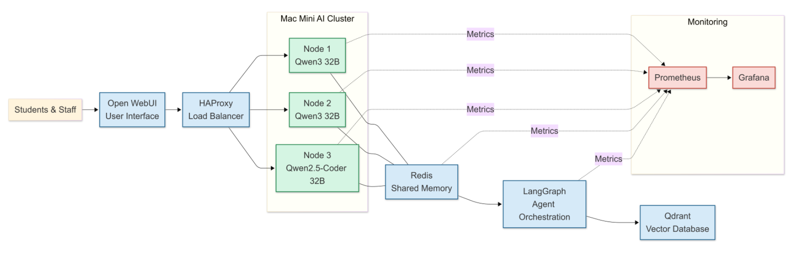

+++
date = '2026-07-10T09:55:46+01:00'
title = 'Building a Mac Mini Pro AI Cluster'
categories = ["AI", "Programs"]
tags = ["Mac"]
+++
I have been desigining a three-node cluster for an AI system with Mac Mini Pros. It is going to contain autonomous agents for research and programming purposes, in order to avoid the costs of using a third-party service.

## The Problems With Third-Party AI Services
- Ongoing subscription costs
- Vendor lock-in
- Limited control over personal data
- Performance loss during peak usage
- Dependence on availability of the provider

## Selected AI Models
| Model | Parameters | Quantization | Purpose |
|-------|------------|--------------|---------|
|Qwen3|32B|4-bit|Primary Reasoning|
|Qwen2.5-Coder|32B|4-bit|Coding|
|DeepSeek-R1 Distill|32B|4-bit|Research|
|Qwen|14B|4-bit|Routing|

I mainly chose Qwen models since they reduce memory requirements while maintaining high inference quality.

## Architecture

| Component | Purpose |
|-----------|---------|
|MLX-LM|AI Runtime Stack|
|Redis|In-Memory Database|
|LangGraph|Orechestration Framework|
|HAProxy|Traffic Controller|
|Qdrant|Vector Database|
|Open WebUI|User Interface|
|Prometheus + Grafana|Monitoring|

